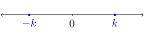
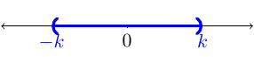
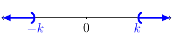
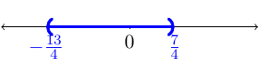

# Section 1.8

## Review

$$|x|=\left\{ \begin{matrix}x & x\le0\\
-x & x>0
\end{matrix}\right.$$

Remember that the absolute value doesn't just change a negative number to a positive one. The absolute value of a number is the distance the number is away from zero. Another way to write the absolute value of a number is $x=\sqrt{x^2}$.

* Given, $|x|=k$, the graph would look like:  and the set would $\{-k,k\}$.
* Given, $|x|<k$, the graph would look like:  and the interval notation would be $(-k,k)$.
* Given, $|x|>k$, the graph would look like:  and the interval notation would be $(-\infty,-k)\cup(k,\infty)$.

## Absolute Value Equations

::::{prf:example}
:label: absEquation1
Solve $|9-4x| = 7$

:::{dropdown} Solution:
Remember $|X|=k$ if and only if $X=-k$ or $X=k$. This means we will create two equations to solve:
\begin{align*}
    9-4x & = 7 & 9-4x & = -7\\
    -4x & = -2 & -4x & = -16\\
    x & = \frac{1}{2} & x & = 4
\end{align*}

Therefore, the solution set for the equation is $\{\frac{1}{2},4\}$.
:::
::::

Remember, the absolute value expression must be isolated before splitting into two equations.

::::{prf:example}
:label: absEquation2
Solve $|2x+3|+1 = 5$

:::{dropdown} Solution:
First, we need to isolate the absolute value expression:
\begin{align*}
    |2x+3|+1 & = 5\\
    |2x+3|  = 4
\end{align*}
Next, we split the equation into two equations. That is, we what to know when $2x+3$ is equal to $4$ and $-4$.
\begin{align*}
    2x+3 & = 4 & 2x+4 & = -4\\
    2x & = 1 & 2x & = -7\\
    x & = \frac{1}{2} & x & = -\frac{7}{2}
\end{align*}
Therefore, the solution set is $\{\frac{1}{2},-\frac{7}{2}\}$.
:::
::::

## Absolute Value Inequality
Remember the absolute value of some number, $X$, is the distance $X$ is away from zero. When it comes to inequalities we want to know the collection of numbers that satisfies the conditions.

### $|X|<k$
Remember when we have $|X|<k$ we want to find all $X$ values such that the size of $X$ is smaller than $k$.
::::{prf:example}
:label: absSmallInequality1
Solve $|4x+3|<10$

:::{dropdown} Solution:
For this inequality, we want to know when $4x+3>-10$ and $4x+3<10$. It is important to understand why geometrically. Solving the two inequalities we have
\begin{align*}
    4x+3 & > -10 & 4x+3 & < 10\\
    4x & > -13 & 4x & < 7\\
    x & > -\frac{13}{4} & x & < \frac{7}{4}
\end{align*}
We then graph this solution: 

The solution in interval notation would be $(-\frac{13}{4},\frac{7}{4})$.
:::
::::

### $|X|>k$
Remember when we have $|X|>k$ we want to find all $X$ values such that the size of $X$ is bigger than $k$.
::::{prf:example}
:label: absBigInequality1
Solve $|5x+10|>5$

:::{dropdown} Solution:
Here we want to find all the $x$ such that the size of $5x+10$ is larger than $5$ units away from zero. That is, we want to solve these two inequalities: $5x+10>5$ and $5x+10<-5$.
\begin{align*}
    5x+10 & > 5 & 5x+10 & < -5\\
    5x & > -5 & 5x & < -15\\
    x & > -1 & x & < -3
\end{align*}
The graph of the solution would be:

The solution in interval notation would be $(-\infty,-1)\cup(-3,\infty)$.
:::
::::