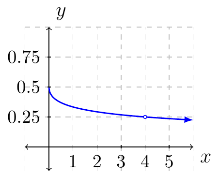

# Section 2.1

Given $y=f(x)$ is a function defined everywhere on the interval $[a,b]$. The average rate of change of the function over that interval would be:

$$\frac{f(b)-f(a)}{b-a}$$

or

$$\frac{\Delta y}{\Delta x}$$

where $\Delta y = f(b)-f(a)$ and $\Delta x = b-a$.

When $\Delta x \ne 0$ then the quotient is defined. However, in order to find the instantaneous rate of change we require $\Delta x = 0$ (or at least approach zero).

::::{prf:example}
:label: exam1ARC

Let $f(x)=\sqrt{x}$. 

Find the average rate of change **over the interval** $[4,9]$.

:::{dropdown} Solution:

$$\Delta y = f(9)-f(4)=3-2=1$$

$$\Delta x = 9-4 = 5$$

Therefore, the average rate of change is:

$$m_{\text{ave}} = \frac{\Delta y}{\Delta x} = \frac{1}{5}$$
:::

Find the instantaneous rate of change **at** $(4,2)$.

:::{dropdown} Solution:

If we consider the average rate of change of $f$ near $4$ we have the following expression to look at:

\begin{align*}
    m(x) & = \frac{f(x)-f(4)}{x-4}\\
    & = \frac{\sqrt{x}-\sqrt{4}}{x-4}\\
    & = \frac{\sqrt{x}-2}{x-4}
\end{align*}

where the variable $x$ is a value near $4$. If we plot the function we have:

From the graph we can see that the slopes are approaching $0.25$ but never will touch it.

We say that the instantaneous rate of change of $f$ at $x=4$ is $0.25$.

:::
::::

In the next section we will look at a more defined way of approaching this concept. The operator we will use is called the limit operator.