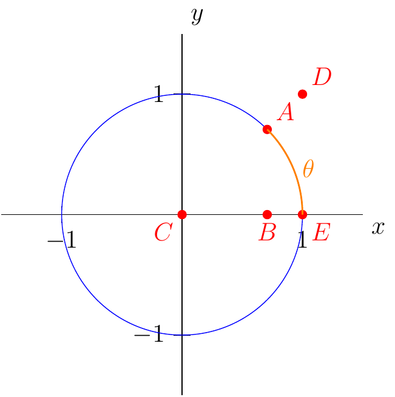

# Section 2.2

:::{prf:definition} Informal Definition of the Limit of a Function.
:label: informalLimit

If $f(x)$ is arbitrarily close to the number $L$ for all $x$ sufficiently close to $c$, other than $c$ itself, then we say that $f$ approaches the limit $L$ as $x$ approaches $c$, and is denoted:

$$\lim_{x\to c}f(x)=L$$
:::

In the last section we saw that $m(x)=\frac{\sqrt{x}-2}{x-4}$ was approaching $0.25$ as $x$ approaches $4$ using a graph.

That is saying:

$$\lim_{x\to 4}\frac{\sqrt{x}-2}{x-4} = 0.25$$

Using a graph is one way of evaluating a limit situation. However, there are other ways to evaluate limits.

:::{prf:theorem} Laws of Limits

Let $\lim_{x\to c}f(x)$ and $\lim_{x\to c}g(x)$ exist. Then the following hold true.

* $\lim_{x\to c} (f(x)\pm g(x)) = \lim_{x\to c}f(x) \pm \lim_{x\to c}g(x)$
* $\lim_{x\to c} kf(x) = k \lim_{x\to c}f(x)$ where $k$ is some real number.
* $\lim_{x\to c} f(x)\cdot g(x) = \lim_{x\to c}f(x) \cdot \lim_{x\to c}g(x)$
* $\lim_{x\to c} \frac{f(x)}{g(x)} = \frac{\lim_{x\to c}f(x)}{\lim_{x\to c}g(x)}$ provided $\lim_{x\to c}g(x)\ne 0$.
* $\lim_{x\to c}f^n(x) = \left( \lim_{x\to c}f(x) \right)^n$ provided $n$ is a natural number.
* $\lim_{x\to c}\sqrt{x} = \sqrt{\lim_{x\to c} x}$
* $\lim_{x\to c} x = c$
* $\lim_{x\to c} k = k$ where $k$ is some real number.

:::

:::{prf:example}
:label: basicLimit1

$$\lim_{x\to 3} 5 = 5$$
$$\lim_{x\to \sqrt2} \frac{\pi}{3} = \frac{\pi}{3}$$
$$\lim_{x\to 5} x = 5$$
\begin{align*}
    \lim_{x\to -3} x^3 & = \left( \lim_{x\to -3}x \right)^3\\
    & = (-3)^3\\
    & = -27
\end{align*}

\begin{align*}
    \lim_{x\to 2} \left( x^2 + x + 1\right) & = \lim_{x\to 2}x^2 + \lim_{x\to 2} x + \lim_{x\to 2} 1\\
    & = \left( \lim_{x\to 2} x \right)^2 + 2 + 1\\
    & = (2)^2 +3\\
    & = 4+3\\
    & = 7
\end{align*}

:::

From the previous example we can see the following.

:::{prf:theorem}
:label: polyLimit

Let $P(x)$ and $Q(x)$ be polynomial functions. Then

$$\lim_{x\to c} P(x) = P(c)$$

$$\lim_{x\to c} \frac{P(x)}{Q(x)} = \frac{P(c)}{Q(c)}$$

provided $Q(c)\ne 0$.

:::

The next concept we will look at is when laws of limits doesn't help evaluate a limit.

## Evaluating Limits Algebraically

:::{prf:theorem}
:label: almostLimit

If $f(x)=g(x)$ for all $x$ such that $x\ne c$. Then

$$\lim_{x\to c}f(x)=\lim_{x\to c}g(x)$$

:::

We have seen that 

$$\lim_{x\to 4} \frac{\sqrt{x}-2}{x-4} = 0.25$$

graphically. Now, we can use the previous theorem to evaluate the limit algebraically.

::::{prf:example}
:label: almostExamLimit1

Evaluate $\lim_{x\to 4}\frac{\sqrt{x}-2}{x-4}$.

:::{dropdown} Solution:

Let $f(x)=\frac{\sqrt{x}-2}{x-4}$. If we rationalize the numerator we have:

\begin{align*}
    \frac{\sqrt{x}-2}{x-4}\cdot \left( \frac{\sqrt{x}+2}{\sqrt{x}+2}\right) & = \frac{\cancel{x-4}}{\cancel{(x-4)}(\sqrt{x}+2)}\\
    & = \frac{1}{\sqrt{x}+2}
\end{align*}

From this we let $g(x)=\dfrac{1}{\sqrt{x}+2}$. Notice that $f(x)=g(x)$ everywhere except at $x=4$. This means we can now use the theorem.

\begin{align*}
    \lim_{x\to 4}\frac{\sqrt{x}-2}{x-4} & = \lim_{x\to 4} \frac{1}{\sqrt{x}+2}\\
    & = ...\\
    & = \frac{\lim_{x\to 4} 1 }{\sqrt{\lim_{x\to 4} x}+\lim_{x\to 4} 2}\\
    & = \frac{1}{\sqrt{4}+2}\\
    & = \frac{1}{2+2}\\
    & = \frac{1}{4} \text{ or } 0.25
\end{align*}

:::
::::

::::{prf:example}
:label: almostExamLimit2

Evaluate 

$$\lim_{x\to 2} \dfrac{x^2-4}{x-2}$$

:::{dropbox} Solution:

\begin{align*}
    \lim_{x\to 2} \frac{x^2-4}{x-2} & = \lim_{x\to 2}\frac{\cancel{(x-2)}(x+2)}{\cancel{x-2}}\\
    & = \lim_{x\to 2} (x+2)\\
    & = 2+2\\
    & = 4
\end{align*}

:::
::::

::::{prf:example}
:label: almostExamLimit3

Evaluate

$$\lim_{q\to -2} \frac{q+2}{q^2+5q+6}$$

:::{dropdown} Solution:

\begin{align*}
    \lim_{q\to -2} \frac{q+2}{q^2+5q+6} & = \lim_{q\to -2} \frac{\cancel{q+2}}{\cancel{(q+2)}(q+3)}\\
    & = \lim_{q\to -2} \frac{1}{q+3}\\
    & = \frac{1}{-2+3}\\
    & = 1
\end{align*}

:::
::::

::::{prf:example}
:label: almostExamLimit4

Evaluate

$$\lim_{x\to -3} \frac{\frac{x}{3}-\frac{3}{x}}{\frac{1}{3}+\frac{1}{x}}$$

:::{dropdown} Solution:

\begin{align*}
    \lim_{x\to -3} \frac{\frac{x}{3}-\frac{3}{x}}{\frac{1}{3}+\frac{1}{x}}\cdot \left( \frac{3x}{3x} \right) & = \lim_{x\to -3} \frac{x^2-9}{x+3}\\
    & = \lim_{x\to -3} \frac{\cancel{(x+3)}(x-3)}{\cancel{x+3}}\\
    & = \lim_{x\to -3} (x-3)\\
    & = -3-3\\
     = -6
\end{align*}

:::
::::

## Squeeze (or Sandwich) Theorem

:::{prf:theorem} Squeeze (or Sandwich) Theorem
:label: squeezeThm

Suppose that $g(x)\le f(x) \le h(x)$ for all $x$ in some open interval containing $c$, except possibly $c$.

Suppose

$$\lim_{x\to c} g(x) = \lim_{x\to c} h(x) = L$$

Then

$$\lim_{x\to c} f(x) = L$$

:::

::::{prf:example}
:label: sqzExam1

Let $\sqrt{5-2x^2}\le f(x) \le \sqrt{5-x^2}$ for all $x\in (-1,1)$. Evaluate $\lim_{x\to 0} f(x)$.

:::{dropdown} Solution:

Here we will use Squeeze Theorem. We are given the first condition of the theorem:

$$\sqrt{5-2x^2}\le f(x) \le \sqrt{5-x^2}$$

for all $x$ on the open interval $(-1,1)$.

Next, we must show and find $L$

$$\lim_{x\to 0}\sqrt{5-2x^2}=\lim_{x\to 0} \sqrt{5-x^2}=L$$

**(scratch work)**

\begin{align*}
    \lim_{x\to 0}\sqrt{5-2x^2} & = \sqrt{5-2(0)^2}\\
    & = \sqrt{5}\\
    \lim_{x\to 0} \sqrt{5-x^2} & = \sqrt{5-0}\\
    & = \sqrt{5}
\end{align*}

That is,

$$\lim_{x\to 0}\sqrt{5-2x^2} = \lim_{x\to 0}\sqrt{5-x^2} = \sqrt{5}$$

Therefore, by Squeeze Theorem, we have,

$$\lim_{x\to 0} f(x) = 0$$

:::
::::

::::{prf:example}
:label: sqzExam2

Evaluate

$$\lim_{x\to 0} x^2\cos(\frac{1}{x})$$

:::{dropdown} Solution:

Here we will use Squeeze Theorem. First, we need to construct an inequality.

We now for all $x$

$$-1\le \cos(x) \le 1$$

Also,

$$-1\le \cos(\frac{1}{x}) \le 1$$

for all $x$ on an open interval near zero, but except at zero.

This is almost our interval we will use for the squeeze theorem. However, we notice that we want the expression $x^2\cos(\frac{1}{x})$. This can be achieved by multiplying by $x^2$ to the inequality. That is, for all $x$ near zero, except at zero, we have,

$$-x^2 \le x^2 \cos(\frac{1}{x}) \le x^2$$

Therefore, the first condition for Squeeze Theorem is satisfied.

Next, we must verify the second condition. That is,

$$\lim_{x\to 0} (-x^2) = \lim_{x\to 0} x^2 = 0$$

Therefore, by Squeeze Theorem, we have,

$$\lim_{x\to 0} x^2\cos(\frac{1}{x}) = 0$$

:::
::::

::::{prf:example}
:label: sqzExam3

Use Squeeze Theorem to show

$$\lim_{\theta \to 0} \frac{\sin(\theta)}{\theta} = 1$$

:::{dropdown} Proof:

Consider the following construction.

We want to find $g(\theta)$ and $h(\theta)$ such that

$$g(\theta)\le \frac{\sin(\theta)}{\theta} \le h(\theta)$$

for all $x$ in an open interval containing zero.

Then we must show $\lim_{\theta\to 0}g(\theta)=\lim_{\theta\to 0}h(\theta)=1$.

First, we will find $h(\theta)$.

---

From the construction above we know the area of $\triangle ABC$ is $\frac{1}{2}\cos(\theta)\cdot \sin(\theta)$. Also, we know the sector area from $A$ to $E$ is $\frac{1}{2} \theta(1)$. Finally, we know that as $A$ gets closer to $E$ along the circle the area of the triangle is smaller than the area of the sector. That is,

$$\frac{1}{2}\cos(\theta)\sin(\theta)\le \frac{1}{2}\theta$$

or

$$\frac{\sin(\theta)}{\theta} \le \frac{1}{\cos(\theta)}$$

where $\theta$ is on some open interval near zero, but not zero.

Therefore, let $h(\theta)=\dfrac{1}{\cos(\theta)}$.

---

Next, we will find $g(x)$

---

From the construction we now $\triangle DCE$ has an area of $\frac{1}{2}\tan(\theta)$. Also, we now that the area of the sector will be always be smaller than the area of $\triangle DCE$. That is,

$$\frac{1}{2}\theta \le \frac{1}{2}\tan(\theta)$$

or

$$\cos(\theta)\le \frac{\sin(\theta)}{\theta}$$

where $\theta$ is on some open interval near zero, but not zero.

Therefore, $g(\theta)=\cos(\theta)$

---

So far we have

$$\cos(\theta) \le \frac{\sin(\theta)}{\theta} \le \frac{1}{\cos(\theta)}$$

where $\theta is on an open interval containing zero, but not zero.

Now, we want to show: $\lim_{\theta\to 0}g(\theta)=\lim_{\theta\to 0}h(\theta)=1$.

---

First,

$$\lim_{\theta \to 0} \cos(\theta)=1$$

Second, 

$$\lim_{\theta \to 0} \frac{1}{\cos(\theta)} =\frac{1}{1} = 1$$

Therefore,

$$\lim_{\theta \to 0}\cos(\theta) = \lim_{\theta \to 0} \frac{1}{\cos(\theta)} = 1$$

---

All together now.

---
Since

$$\cos(\theta) \le \frac{\sin(\theta)}{\theta} \le \frac{1}{\cos(\theta)}$$ 

for all $\theta$ on an open interval containing zero, but not zero, and 

$$\lim_{\theta \to 0}\cos(\theta) = \lim_{\theta \to 0} \frac{1}{\cos(\theta)} = 1$$

we can then say by Squeeze Theorem

$$\lim_{\theta \to 0}\frac{\sin(\theta)}{\theta} = 1.$$

:::
::::