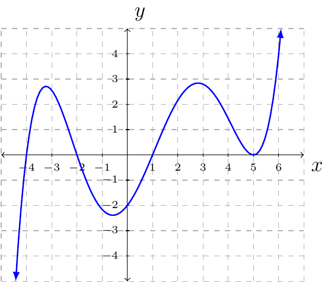

# Section 3.4

:::{prf:property}
:label: powerFunctionProp
Let $f(x)=ax^n$ where $n$ is a positive integer and $a$ is a nonzero real number.

* If $|a|>1$ then the graph is stretched vertically.
* If $0<|a|<1$ then the graph is shrinking vertically.
* If $a<0$ then the graph is reflected about the $x$-axis.
* The graph of $y=f(x)+k$ is the graph of $f$ shifted up or down.
* The graph of $y=f(x-h)$ is the graph of $f$ shifted left or right.

End behaviors of $f(x)=ax^n$.

If $n$ is odd and
* $a>0$ then
    - $f(x)\to\infty$ as $x\to \infty$.
    - $f(x)\to-\infty$ as $x\to -\infty$.
* $a<0$ then
    - $f(x)\to -\infty$ as $x\to \infty$.
    - $f(x)\to \infty$ as $x\to -\infty$.

If $n$ is even and
* $a>0$ then
    - $f(x)\to\infty$ as $x\to \infty$.
    - $f(x)\to\infty$ as $x\to -\infty$.
* $a<0$ then
    - $f(x)\to-\infty$ as $x\to\infty$.
    - $f(x)\to-\infty$ as $x\to-\infty$.

Multiplicity of Zeros

Since $f(x)=ax^n$. It is true $f(0)=0$.

* If $n$ is even, then the graph of $f$ will touch the $x$-axis but never cross.
* If $n$ is odd, then the graph of $f$ will cross the $x$-axis.

Turning Points

A polynomial of degree $n$ has at most $n-1$ turning points, with at least one turning point between each pair of successive zeros.
:::

:::{prf:thoerem} Intermediate Value Theorem (IVT)
:label: IVT
Let $f(x)$ be a polynomial. If $a<b$ and the number $L$ is between $f(a)$ and $f(b)$ then there exists a number $c$ in $(a,b)$ such that $f(c)=L$.
:::

::::{prf:example} 
:label: IVTexam1
Show $f(x)=x^3+x+1$ has at least one zero on the interval $[-1,0]$.
:::{dropdown} Solution:
First, scratch work. $f(0)=1$ and $f(-1)=(-1)^3+(-1)+1=-1$.

Now, the proof. Since $f(x)$ is a polynomial and $f(-1)<0<f(0)$ there exists a $c$ in $(-1,0)$ such that $f(c)=0$, by IVT. Therefore, $f$ has at least one zero on the interval $[-1,0]$.
:::
::::

::::{prf:example}
:label: modelExam11
A certain right triangle has an area $30$ square inches. One leg of the triangle measures 1 inch less than the hypotenuse. Let $x$ represent the length of the hypotenuse. Complete the following:

Express the length of the leg mentioned above in terms of $x$. What are the possible values for $x$. That is, what is the domain of $x$.
:::{dropdown} Solution:
Draw a triangle and label the legs $l$ and $b$ and denote the hypotenuse $x$. The base of the triangle will be $b=x-1$ since: "One leg of the triangle measures 1 inch less than the hypotenuse". The height of the triangle will be $l$. If $x=1$ then the length of $b$ would be zero. If $0<x<1$, then the length of $b$ would be negative. Therefore, $x$ must be strictly greater than $1$. That is, the domain of $x$ is $(1,\infty)$.
:::

Find the length of the other leg.
:::{dropdown} Solution:
We have hypotenuse is $x$ and the length of one leg is $b=x-1$. We will use the Pythagorean Theorem to find the length of $l$ in terms of $x$. That is,

\begin{align*}
    l^2+b^2 & = x^2\\
    l^2 + (x-1)^2 & = x^2\\
    l^2 & = x^2-(x-1)^2\\
    & = x^2 - (x^2-2x+1)\\
    & = 2x-1\\
    l & = \sqrt{2x-1}
\end{align*}

The length of the missing leg is $l=\sqrt{2x-1}$. 
:::

Write and equation based on the triangle having an area of 30 square inches and the information determined thus far.
:::{dropdown} Solution:
Since the area of a triangle is $A=\frac{1}{2}bl$, $b=x-1$, $l=\sqrt{2x-1}$ and $A=30$ we have the following equation to solve.

\begin{align*}
    \frac{1}{2}bl & = 30\\
    \frac{1}{2}(x-1)\sqrt{2x-1} & = 30\\
    (x-1)\sqrt{2x-1} & = 60\\
    (x-1)^2(2x-1) & = 60^2\\
    (x^2-2x+1)(2x-1) & = 3600\\
    2x^3 - 5x^2 +4x - 3601 & = 0
\end{align*}
:::

Find the dimensions of the triangle.
:::{dropdown} Solution:
Solving $2x^3-5x^2+4x-3601=0$ will give the dimension for the hypotenuse (and the rest of the dimension).

The list of possible rational zeros is $\pm1$, $\pm13$, $\pm277$, and $\pm3601$. Using the remainder theorem and synthetic division we have $x=1$, $x=-1$, and $x=-13$ are not zeros. We then find through the remainder theorem and synthetic division that $x=13$ is a zero. This means the hyptenuse is $13$ inches, $b=13-1=12$ inches, and $l=\sqrt{2(13)-1}=5$ inches.
:::
::::

::::{prf:example}
:label: findFunctionGraph
Find a polynomial of the least possible degree having the graph shown.

:::{dropdown} Solution:
From the graph we see 
* $x=5$ is a zero with an even multiplicity. (For the lowest degree possible we will say multiplicity 2.)
* $x=1$, $x=-2$, and $x=1$ is a zero with odd multiplicity. (For the lowest degree possible we will say multiplicity 1.)
* $f(0)=-2$

By the Factoring Theorem we have $f(x)=a(x-5)^2(x-1)(x+2)(x+4)$. We solve for $a$ using the fact that $f(0)=-2$.

\begin{align*}
    a(0-5)^2(0-1)(0+2)(0+4) & = -2\\
    -200a & = -2\\
    a & = \frac{-2}{-200}\\
    & = \frac{1}{100}
\end{align*}

Therefore, the polynomial of the least degree is 

$$\frac{1}{100}(x-5)^2(x-1)(x+2)(x+4)$$

(or expanded $\frac{1}{100}x^5-\frac{1}{20}x^4-\frac{23}{100}x^3+\frac{97}{100}x^2+\frac{13}{10}x-2$).
:::
::::