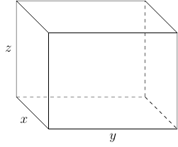

# Section 5.5

In this section we will look at solving nonlinear system of equations.

::::{prf:example}
:label: nonLinearSystem1

Solve the system

$$
\begin{cases}
x^{2}-y & =4\\
x+y & =-2
\end{cases}
$$

:::{dropdown} Solution:

Notice this is not a system of linear equations. However, we can simply rewrite the system as follows 

$$
\begin{cases}
x^{2}-y & =4\\
x+y & =-2
\end{cases}\to\begin{cases}
y & =x^{2}-4\\
y & =-x-2
\end{cases}
$$

and notice that 

$$
y=y\iff x^{2}-4=-x-2
$$

Solving

\begin{align*}
x^{2}-4 & =-x-2\\
x^{2}+x-4+2 & =0\\
x^{2}+x-2 & =0\\
(x+2)(x-1) & =0
\end{align*}

we have $x=-2$ and $x=1$.

When $x=-2$ we have

$$
-2+y=-2\iff y=0
$$

When $x=1$ we have

$$
1+y=-2\iff y=-3.
$$

Therefore, the solution set for the system is $\{(-2,0),(1,-3)\}$.

:::
::::

::::{prf:example}
:label: nonLinearSystem2

Solve the system

$$
\begin{cases}
x^{2}+y^{2} & =9\\
9x^{2}+4y^{2} & =36
\end{cases}
$$

:::{dropdown} Solution:

Here we will use the elimination method to solve for $y$

\begin{align*}
\begin{cases}
x^{2}+y^{2} & =9\\
9x^{2}+4y^{2} & =36
\end{cases} & \to\begin{cases}
9x^{2}+9y^{2} & =81\\
9x^{2}+4y^{2} & =36
\end{cases}\\
 & \to5y^{2}=45\\
 & \to y^{2}=9\\
 & \to y=\pm3
\end{align*}

When $y=3$ we have

\begin{align*}
x^{2}+(3)^{3} & =9\\
x^{2}+9 & =9\\
x^{2} & =0\implies x=0
\end{align*}

When $y=-3$ we have

\begin{align*}
x^{2}+(-3)^{2} & =9\\
x^{2}+9 & =0\\
x^{2} & =0\implies x=0
\end{align*}

Therefore, the solution set for the system is $\{(0,3),(0,-3)\}$.

:::
::::

::::{prf:example}
:label: nonLinearSystem3

Solve the system

$$
\begin{cases}
x^{2}+xy+y^{2} & =21\\
x^{2}-xy+y^{2} & =9
\end{cases}
$$

:::{dropdown} Solution:

If use the elimination method we have

\begin{align*}
\begin{cases}
x^{2}+xy+y^{2} & =21\\
x^{2}-xy+y^{2} & =9
\end{cases} & \to2x^{2}+2y^{2}=30\\
 & \to x^{2}+y^{2}=15\\
 & \to\begin{cases}
y^{2} & =15-x^{2}\\
y & =\pm\sqrt{15-x^{2}}
\end{cases}
\end{align*}

---

When $y=15-x^{2}$ and $y=\sqrt{15-x^{2}}$

\begin{align*}
x^{2}+x\sqrt{15-x^{2}}+15-x^{2} & =21\\
x\sqrt{15-x^{2}}+15 & =21\\
x\sqrt{15-x^{2}} & =6\\
\sqrt{15-x^{2}} & =\frac{6}{x}\\
15-x^{2} & =\frac{36}{x^{2}}\\
15x^{2}-x^{4} & =36\\
x^{4}-15x^{2}+36 & =0\\
(x^{2}-12)(x^{2}-3) & =0\\
x^{2} & =12\implies x=\pm\sqrt{12}=\pm2\sqrt{3}\\
x^{2} & =3\implies x=\pm\sqrt{3}
\end{align*}

When we go back to 

\begin{align*}
x^{2}+x\sqrt{15-x^{2}}+15-x^{2} & =21\\
x\sqrt{15-x^{2}}+15 & =21\\
x\sqrt{15-x^{2}} & =6
\end{align*}

We see that $x\ne-\sqrt{3}$ and $x\ne-2\sqrt{3}$ (check on your own). Therefore, $x=\sqrt{3}$ or $x=2\sqrt{3}$.

When $x=\sqrt{3}$ we have $y=\sqrt{15-(\sqrt{3})^{2}}=2\sqrt{3}$.

When $x=2\sqrt{3}$ we have $y=\sqrt{15-(2\sqrt{3})^{2}}=\sqrt{3}$. Therefore, two elements in the solution set is $\{(\sqrt{3},2\sqrt{3}),(2\sqrt{3},\sqrt{3})\}$.

---

When $y^{2}=15-x^{2}$ and $y=-\sqrt{15-x^{2}}$ we have

\begin{align*}
x^{2}-x\sqrt{15-x^{2}}+15-x^{2} & =21\\
-x\sqrt{15-x^{2}}+15 & =21\\
-x\sqrt{15-x^{2}} & =6\\
\sqrt{15-x^{2}} & =-\frac{6}{x}\\
15-x^{2} & =\frac{36}{x^{2}}\\
15x^{2}-x^{4} & =36\\
x^{4}-15x+36 & =0
\end{align*}

which we already know the solution to, $\{\pm\sqrt{3},\pm2\sqrt{3}\}$.

However, when we look at

\begin{align*}
x^{2}-x\sqrt{15-x^{2}}+15-x^{2} & =21\\
-x\sqrt{15-x^{2}}+15 & =21\\
-x\sqrt{15-x^{2}} & =6
\end{align*}

we see that $x\ne\sqrt{3}$ and $x\ne2\sqrt{3}$ (check on your own). Therefore, $x=-\sqrt{3}$ and $x=-2\sqrt{3}$.

When $x=-\sqrt{3}$ we have $y=-\sqrt{15-(-\sqrt{3})^{2}}=-2\sqrt{3}$.

When $x=-2\sqrt{3}$ we have $y=-\sqrt{15-(-2\sqrt{3})^{2}}=-\sqrt{3}$.

This then added $(-\sqrt{3},-2\sqrt{3})$ and $(-2\sqrt{3},-\sqrt{3})$ to the solution set.

---

Therefore, the solution set is 

$$
\{(\sqrt{3},2\sqrt{3}),(2\sqrt{3},\sqrt{3}),(-\sqrt{3},-2\sqrt{3}),(-2\sqrt{3},-\sqrt{3})\}
$$

:::
::::

::::{prf:example}
:label: nonLinearSystem4

Solve the system

$$
\begin{cases}
x^{2}+y^{2} & =4\\
-|x|+y & =0
\end{cases}
$$

:::{dropdown} Solution:

First, we will solve for $|x|$ in the second equation:

\begin{align*}
-|x|+y & =0\\
-|x| & =-y\\
|x| & =y
\end{align*}

Since $x^{2}=\left(|x|\right)^{2}$ we can say $y^{2}=\left(|x|\right)^{2}=x^{2}$.

Looking at the first equation we have

\begin{align*}
x^{2}+x^{2} & =4\\
2x^{2} & =4\\
x^{2} & =2\\
x & =\pm\sqrt{2}
\end{align*}

---

When $x=\sqrt{2}$ we have

\begin{align*}
(\sqrt{2})^{2}+y^{2} & =4\\
2+y^{2} & =4\\
y^{2} & =2\\
y & =\pm\sqrt{2}
\end{align*}

However, $|x|=y$ and $|\sqrt{2}|\ne-\sqrt{2}$. Which means $(\sqrt{2},\sqrt{2})$ is apart of the solution set and $(\sqrt{2},-\sqrt{2})$ is not apart of the solution set.

---

When $x=-\sqrt{2}$ we have

\begin{align*}
(-\sqrt{2})^{2}+y^{2} & =4\\
2+y^{2} & =4\\
y & =\pm\sqrt{2}
\end{align*}

However, $|x|=y$ and $|-\sqrt{2}|\ne-\sqrt{2}$. Which means $(-\sqrt{2},\sqrt{2})$ is apart of the solution set and $(-\sqrt{2},-\sqrt{2})$ is not part of the solution set.

---

Therefore, the solution set is $\{(\sqrt{2},\sqrt{2}),(-\sqrt{2},\sqrt{2})\}$.

:::
::::

::::{prf:example}
:label: nonLinearSystemWordProblem

A box with an open top has a square bases and four sides of equal height. The volume is 384 cubic meters, and the surface area is 256 square meters. Find the dimensions of the box. Round to the nearest thousandths as necessary.

:::{dropdown} Solution:

First, we can draw the box. Remember it has an open top.

Second we can consider the two equations involved

$$
\begin{cases}
V & =384\\
S & =256
\end{cases}\to\begin{cases}
xyz & =384\\
2xy+2xz+xy & =256
\end{cases}
$$

which yields a system of two equations and three variables. However,
since the box has a square base we can add another equation to get

\begin{align*}
\begin{cases}
xyz & =384\\
2xy+2xz+xy & =256\\
x & =y
\end{cases} & \to\begin{cases}
x^{2}z & =384\\
x^{2}+4xz & =256
\end{cases}\\
 & \to\begin{cases}
z & =\dfrac{384}{x^{2}}\\
x^{2}+4xz & =256
\end{cases}
\end{align*}

then we can have

\begin{align*}
x^{2}+4x\left(\frac{384}{x^{2}}\right) & =256\\
x^{2}+\frac{1536}{x} & =256\\
x^{3}+1536 & =256x\\
x^{3}-256x+1536 & =0
\end{align*}

The possible solutions are

$$
x=\{\pm1,\pm3,\pm2,\pm4,\pm8,\pm16,\pm32,\pm64,\pm128,\pm256,\pm512,\pm6,\pm12,\pm24,\pm48,\pm96,\pm192,\pm384,\pm768,\pm1536\}.
$$

However, we are limited by what $x$ can possibly be. For example $x$ can not be negative:

$$
x=\{1,3,2,4,8,16,32,64,128,256,512,6,12,24,48,96,192,384,768,1536\}
$$

Let $f(x)=x^3-256x+1536$. Then evaluate $f$ at each of those $x$ values using the Remainder Theorem. Eventually, you will find that $f(8)=0$. After doing polynomial long division you will get

\begin{align*}
x^{3}-256x+1536 & =(x-8)(x^{2}+8x-192)\\
x^{3}-256x+1536 & =0\\
(x-8)(x^{2}+8x-192) & =0\\
x-8 & =0\iff x=8\\
x^{2}+8x-192 & =0\\
x & =\dfrac{-8\pm\sqrt{8^{2}-4(1)(-192)}}{2(1)}\\
 & =\dfrac{-8\pm\sqrt{832}}{2}\\
 & =\dfrac{-8\pm8\sqrt{13}}{2}\\
 & =-4\pm4\sqrt{13}\\
 & =\begin{cases}
-4+4\sqrt{13} & >0\\
-4-4\sqrt{13} & <0
\end{cases}
\end{align*}

Since $x$ must be positive we have two possible dimensions for $x$. That is, $x=8$ or $x=-4+4\sqrt{13}$.

---

When $x=8$ we have

$$
z=\dfrac{384}{8^{2}}=6
$$

which means that $x=8$, $y=8$, and $z=6$.

---

When $x=-4+4\sqrt{13}\approx10.42220510185596$ we have 

\begin{align*}
y & =\dfrac{384}{(-4+4\sqrt{13})^{2}}\\
 & =\dfrac{384}{224-32\sqrt{13}}\\
 & =\frac{12}{7-\sqrt{13}}\\
 & \approx3.535183758487996
\end{align*}

which means $x=-4+4\sqrt{13}$, $y=-4+4\sqrt{13}$, and $z=\frac{12}{7-\sqrt{13}}$.

---

Therefore, the possible dimensions we have

$$
\text{length}=\text{width}=8\text{ and }\text{height}=6
$$

and

$$
\text{length}=\text{width}=-4+4\sqrt{13}\text{ and }\text{height}=\frac{12}{7-\sqrt{13}}.
$$
:::
::::