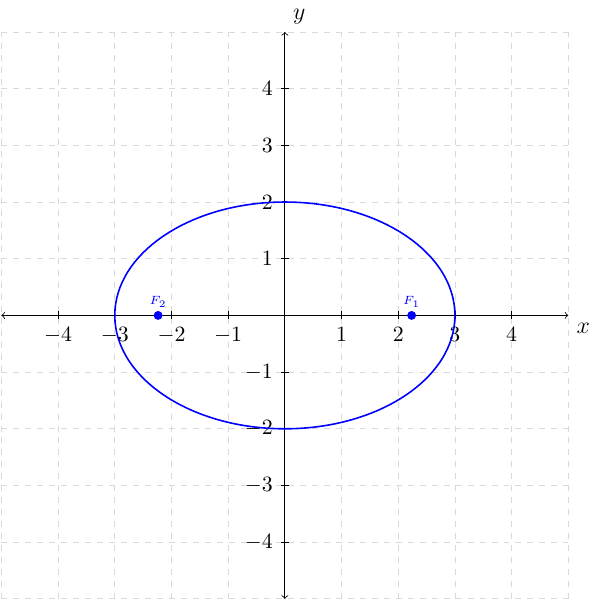
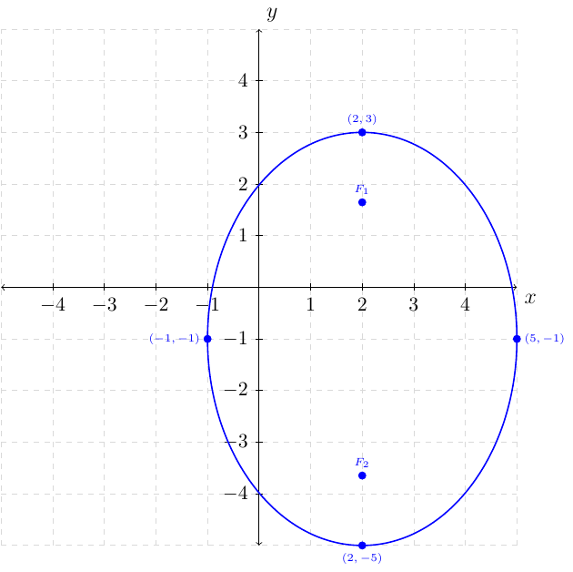

# Section 6.2

:::{prf:definition} Ellipse
:label: ellipseDef

An ellipse is the set of all points in a plane the sum of whose distances from two fixed points is constant. Each fixed point is a focus (plural, foci) of the ellipse.

:::

:::{prf:definition} Standard Forms of Equations for Ellipses
:label: standardFormOrigin

The ellipse with center at the origin and equation

$$
\frac{x^{2}}{a^{2}}+\frac{y^{2}}{b^{2}}=1
$$

where $a>b$ has vertices $(\pm a,0)$, endpoints of the minor axis $(0,\pm b)$, and foci $(\pm c,0)$, where $c^{2}=a^{2}-b^{2}$.

The ellipse with center at the origin and equation

$$
\frac{x^{2}}{b^{2}}+\frac{y^{2}}{a^{2}}=1
$$

where $a>b$ have vertices $(0,\pm a)$, endpoints of the minor axis $(\pm b,0)$, and foci $(0,\pm c)$, where $c^{2}=a^{2}-b^{2}$.
:::

:::{prf:definition} Standard Forms of Equations for Ellipses Centered at $(h,k)$
:label: standardformhk

An ellipse with center at $(h,k)$ and either a horizontal or vertical major axis of length $2a$ satisfies one fo the following equations, where $a>b>0$ and $c^{2}=a^{2}-b^{2}$ with $c>0$.

Ellipses with major axis horizontal, vertices at $(h\pm a,k)$, and foci $(h\pm c,k)$ is

$$
\dfrac{(x-h)^{2}}{a^{2}}+\dfrac{(x-k)^{2}}{b^{2}}=1
$$

Ellipses with major axis vertical, vertices at $(h,k\pm a)$, and foci $(h,k\pm c)$ is

$$
\dfrac{(x-h)^{2}}{b^{2}}+\dfrac{(y-k)^{2}}{a^{2}}=1
$$
:::

::::{prf:example}
:label: ellipseExam1

Graph, find the foci, the domain, and range for the ellipse

$$
4x^{2}+9y^{2}=36
$$

:::{dropdown} Solution:

If we divide the equation by $36$ from both sides we have

$$
\dfrac{x^{2}}{9}+\dfrac{y^{2}}{4}=1.
$$

This means the $x$ intercepts are at $(\pm \sqrt{9},0)=(\pm3,0)$ and the $y$ intercept is at $(0,\pm \sqrt{4})=(0,\pm2)$.

This also means the foci is found by evaluating $c^{2}=9-4=5$ and $c=\sqrt{5}$. Since $9>4$ the foci will be at $(\pm c,0)=(\pm \sqrt{5},0)$.

The major axis is along the $x$-axis and the minor axis is along the $y$.

Plotting the foci, $x$ and $y$ intercepts we have:

:::
::::

::::{prf:example}
:label: ellipseExam2

Write an equation of the ellipse having center at the origin, foci at $(-5,0)$ and $(5,0)$, and major axis of length $18$ units.

:::{dropdown} Solution:

We are given $c=5$ and the major axis is along the $x$ axis. The equation of the ellipse will be of the form

$$
\frac{x^{2}}{a^{2}}+\frac{y^{2}}{b^{2}}=1.
$$

Since the length along the major axis is 18 units we know that the $x$ intercepts will occur at $(\pm \frac{18}{2},0)$ where 

$$
2a=18\to a=9
$$

That is, the $x$ intercepts are at $(\pm 9,0)$. Since $c=5$ and $c^{2}=a^{2}-b^{2}$ where $a=9$ we can solve for $b^{2}$

\begin{align*}
c^{2} & =a^{2}-b^{2}\\
5^{2} & =9^{2}-b^{2}\\
25 & =81-b^{2}\\
b^{2} & =56
\end{align*}

Now that we have: $a^{2}=81$ and $b^{2}=56$ we can construct the ellipse equation

$$
\dfrac{x^{2}}{81}+\dfrac{y^{2}}{56}=1.
$$

To find the domain and range of the ellipse we first identify all of the $x$ and $y$ intercepts. We know that the $x$ intercepts are $(\pm 9,0)$. This means the domain of the ellipse is the set of all $x$ such that $-9\le x\le9$ or $[-9,9]$. We know the $y$ intercepts
are at $(0,\pm \sqrt{56})=(0,\pm 2 \sqrt{14})$ . This means the range of the ellipse is the set of all $y$ such that $-2\sqrt{14}\le y\le2\sqrt{14}$ or $[-2\sqrt{14},2\sqrt{14}]$.
:::
::::

::::{prf:example}
:label: ellipseExam3

Graph $\dfrac{(x-2)^{2}}{9}+\dfrac{(y+1)^{2}}{16}=1$. Give the foci,
domain, and range.

:::{dropdown} Solution:

The graph of the ellipse is centered at $(2,-1)$ where $a=\sqrt{16}=4$ and $b=\sqrt{9}=3$. This ellipse have a major axis along the $y$
axis. That is, the $y$ vertices are at $(2,\pm4-1)=\begin{cases}
(2,3)\\
(2,-5)
\end{cases}$ and the $x$ vertices are at $(\pm3+2,-1)=\begin{cases}
(5,-1)\\
(-1,-1)
\end{cases}$.

For the foci:
\begin{align*}
c^{2} & =a^{2}-b^{2}\\
c^{2} & =16-9\\
 & =7\\
c & =\sqrt{7}
\end{align*}
Since the major axis is vertical and $c=\sqrt{7}$ and have a horizontal shift of right 2 we know the foci is located at $(2,\pm\sqrt{7}-1)=\begin{cases}
(2,\sqrt{7}-1)\\
(2,-\sqrt{7}-1)
\end{cases}$.

For the domain we have $[-1,5]$ and the range is $[-5,3]$ by looking
at the vertices.

The graph of the ellipse is the following:

:::
::::

::::{prf:example}
:label: ellipseExam4

Write the equation of the ellipse in standard form. Give the center,
vertices, and endpoints of the minor axis.

$$
4x^{2}+24x+y^{2}-8y=12
$$

:::{dropdown} Solution:

First, we will want to use completing the square

\begin{align*}
4\left(x^{2}+6x+c_{x}\right)+\left(y^{2}-8y+c_{y}\right) & =12+4c_{x}+c_{y}\\
c_{x} & =\left(\frac{6}{2}\right)^{2}=(3)^{2}=9\\
c_{y} & =\left(\frac{-8}{2}\right)^{2}=(-4)^{2}=16\\
4\left(x^{2}+6x+9\right)+\left(y^{2}-8y+16\right) & =12+4*9+16\\
4(x+3)^{2}+(y-4)^{2} & =64\\
\dfrac{(x+3)^{2}}{16}+\dfrac{(y-4)^{2}}{64} & =1\text{ after dividing both sides by 64}.
\end{align*}

$a=\sqrt{64}=8$ and $b=\sqrt{16}=4$, which means

\begin{align*}
c^{2} & =64-16\\
 & =48\\
c & =\sqrt{48}\\
 & =4\sqrt{3}
\end{align*}

The center is at $(-3,4)$.

The vertices are at 

$$
(-3,\pm8+4)=\begin{cases}
(-3,12)\\
(-3,-4)
\end{cases}
$$

The endpoints of the minor axis is

$$
(\pm4-3,4)=\begin{cases}
(1,4)\\
(-7,4)
\end{cases}
$$

:::
::::